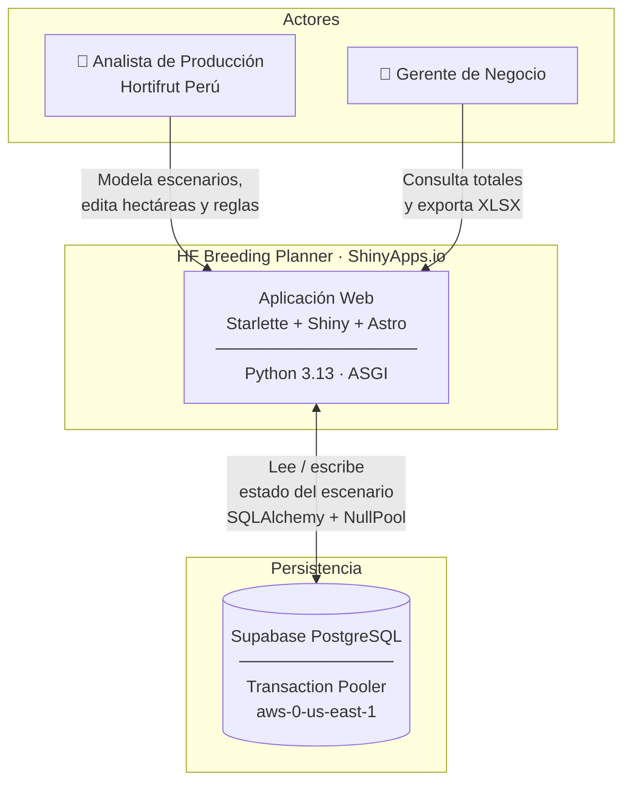
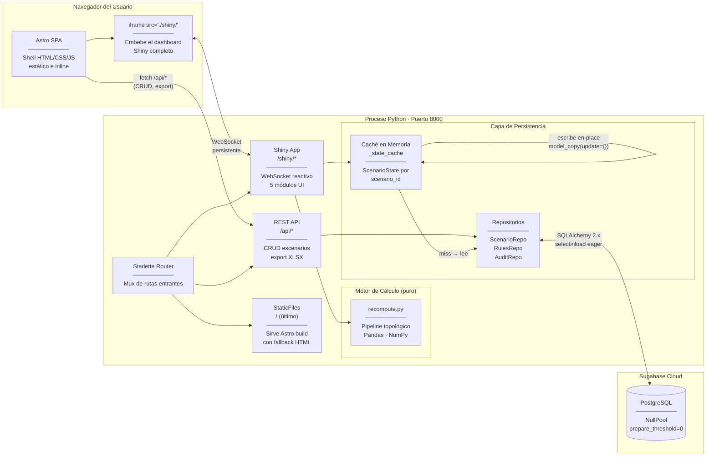
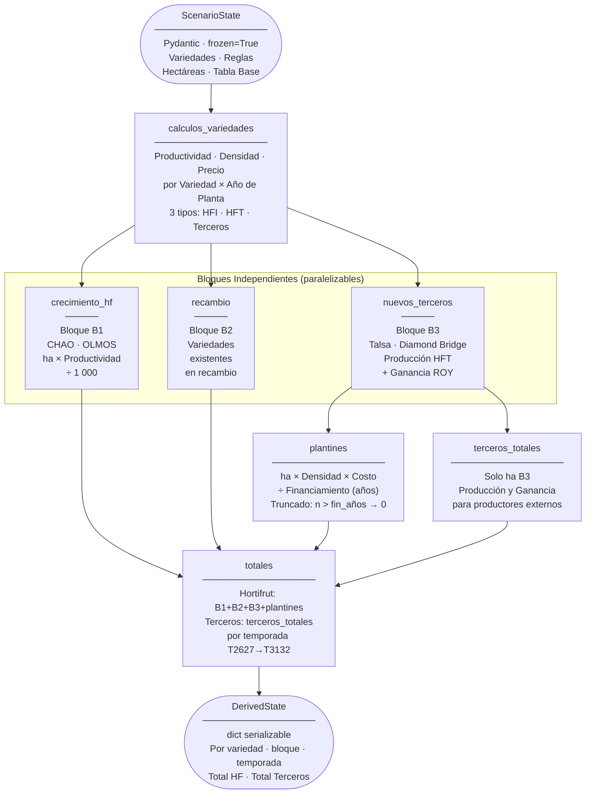
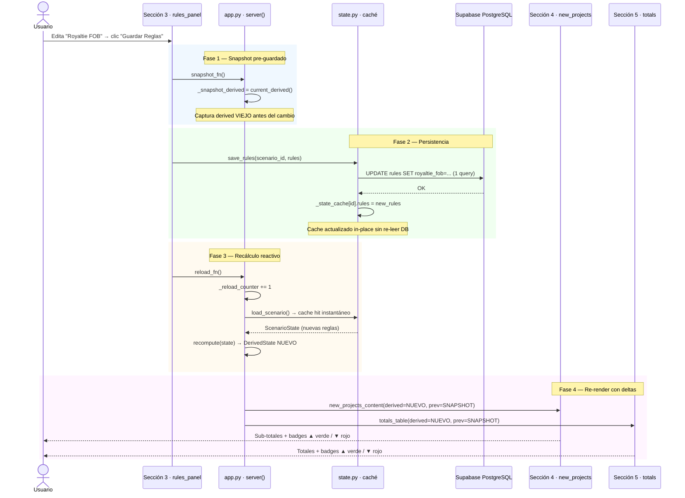
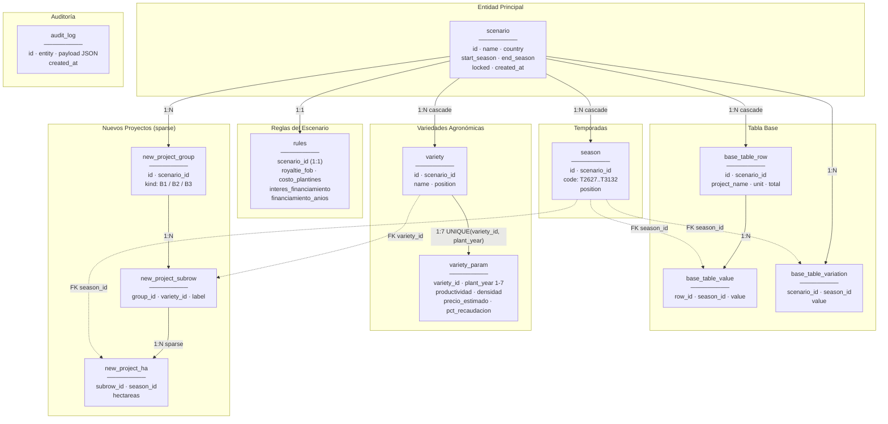
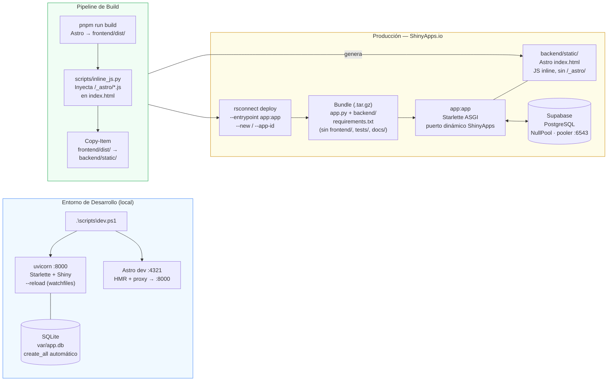

# Arquitectura — HF Breeding Planner

> **Audiencia:** Arquitectos de solución, líderes técnicos y gerentes de TI.
> **Alcance:** Describe la estructura del sistema, las interacciones entre componentes y el modelo de despliegue. Para la especificación funcional y fórmulas de negocio, ver [`docs/description_proyecto.md`](../description_proyecto.md).

---

## 1. Visión General del Sistema (C4 – Nivel Contexto)

El sistema es una aplicación web monolítica de un solo proceso Python. Todos los componentes (API, dashboard reactivo y archivos estáticos) se sirven desde el mismo proceso ASGI, lo que lo hace desplegable en ShinyApps.io sin infraestructura adicional.

**Decisiones arquitectónicas clave:**
- **Un solo proceso** elimina latencia de red interna entre API y motor de cálculo.
- **Starlette** (no FastAPI) es el único framework ASGI compatible con ShinyApps.io.
- **Supabase** proporciona Postgres gestionado con pooler de transacciones, eliminando infraestructura propia.

---

## 2. Componentes Internos (C4 – Nivel Contenedor)

**Flujo de una petición típica (editar hectáreas):**
1. El usuario modifica un valor en la grilla → WebSocket Shiny recibe el evento.
2. Debounce de 1.5 s acumula cambios; solo envía las celdas que difieren del estado guardado.
3. `batch_upsert_ha_cells()` abre una sesión SQLAlchemy, carga mapas en 5 queries batch, hace los upserts y cierra.
4. La caché en memoria se actualiza en-place; `trigger_reload()` incrementa el contador reactivo.
5. `recompute()` recorre el pipeline topológico y produce el nuevo `DerivedState`.
6. Los módulos UI re-renderizan con los nuevos valores.

---

## 3. Pipeline de Cálculo (DAG Topológico)

El motor de cálculo es completamente puro: no lee ni escribe base de datos, no tiene efectos secundarios. Recibe un `ScenarioState` inmutable y devuelve un `DerivedState` serializable.

**Unidades de salida:** toneladas (tn) para producción y miles de USD para ganancias. La conversión ocurre al final de cada bloque (`÷ 1 000`), no durante el cálculo intermedio.

---

## 4. Flujo Reactivo — Guardar Reglas con KPI Delta

Este diagrama describe la interacción más compleja del sistema: el guardado de reglas en Sección 3 con retroalimentación visual de impacto en Secciones 4 y 5.

**Latencia esperada:** < 300 ms total (DB write ~100 ms, recompute ~50 ms, re-render ~50 ms).

---

## 5. Modelo de Datos (Esquema Relacional)

**Nota sobre datos derivados:** Las matrices de producción, ganancia y subtotales **no se persisten**. Se calculan en memoria con Pandas/NumPy en cada recarga del escenario, garantizando consistencia sin riesgo de datos cacheados obsoletos en DB.

---

## 6. Arquitectura de Despliegue

**Por qué `inline_js.py`:** ShinyApps.io sirve la app bajo un sub-path dinámico (e.g. `/usuario/app-name/`). Las rutas absolutas `/_astro/*.js` generadas por Astro rompen en ese contexto. El script inyecta el JS directamente en `index.html`, eliminando todas las referencias a `/_astro/`.

---

## 7. Decisiones Arquitectónicas Relevantes

| Decisión | Alternativa descartada | Razón |
|---|---|---|
| Starlette como host ASGI | FastAPI | ShinyApps.io no soporta `python-fastapi`; los endpoints son funciones puras sin decoradores FastAPI |
| `NullPool` para Supabase | Pool por defecto | Supavisor (transaction pooler) ya gestiona el pool; doble pool causa errores de conexión colgada |
| `prepare_threshold=0` en psycopg3 | Sin configuración | El transaction pooler no mantiene estado de prepared statements entre conexiones; causa `DuplicatePreparedStatement` |
| Caché en memoria por `scenario_id` | Re-lectura a DB en cada reload | Elimina 6-10 queries a Supabase en cada cambio de UI, reduciendo latencia de ~700 ms a ~200 ms |
| `selectinload` eager en `ScenarioRepo.get()` | Lazy loading por defecto | Evita el problema N+1: 1 escenario con 6 relaciones = 6 queries batch vs. 14+ queries lazy |
| Cálculo puro en memoria (sin persistir derived) | Guardar derived en DB | Garantiza consistencia sin riesgo de cache stale; Pandas opera sobre arrays en microsegundos |
| Snapshot del derived antes de guardar reglas | Comparar al re-render | Permite mostrar el delta exacto sin re-calcular con reglas antiguas; el snapshot se captura síncronamente antes del `save_rules` |
| `hostaddr` pre-resuelto en `session.py` | Resolución DNS normal | psycopg3 3.3.x hace DNS lookup síncrono dentro del event loop de asyncio en Python 3.13, causando `UnicodeEncodeError` |
