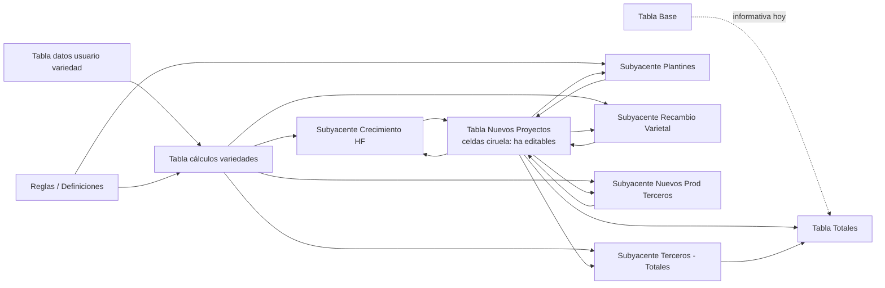

# Documento de Definición Técnica

## Plataforma de Business Planning — Plan Breeding Arándanos (Hortifrut Perú)

> **Propósito del documento:** Servir como única fuente de verdad para que un LLM (y el equipo) pueda producir un plan de arquitectura/implementación detallado. Cubre flujo de datos, modelo de DB, UI (reflejando exactamente `docs/image/UI.png`), todas las fórmulas de negocio (con referencias a las imágenes de respaldo) y el stack tecnológico Astro + Starlette + Shiny for Python.
>
> **Convención de referencias visuales:** cuando se menciona “imagen N” se refiere al par `docs/image/imagenN.png` + `docs/image/imagenN.csv`. La imagen `UI.png` muestra la pantalla maestra consolidada (referencia oficial de layout).

---

## 0. Resumen Ejecutivo

Plataforma analítica e interactiva para simular escenarios de un **business plan de breeding de arándanos** (Perú). El usuario:

1. Confirma un escenario financiero macro **[Tabla Base]** (imagen 1).
2. Da de alta una o más **variedades** con sus parámetros agronómicos por año de plantación **[Tabla datos usuario variedad]** (imagen 2/3).
3. Ajusta opcionalmente la tabla **[Reglas / Definiciones]** (imagen 5) con variables macro/contractuales editables.
4. Edita hectáreas planificadas por temporada y por proyecto en **[Tabla Nuevos Proyectos]** (imagen 6).
5. Observa cómo se recalculan dinámicamente (con **debounce de 1–2 s**) las matrices ocultas y los **Totales** consolidados Hortifrut vs. Terceros.

Todo se calcula en cascada reactiva. La UI replica la maquetación de Excel mostrada en `UI.png`.

---

## 1. Flujo de Datos

### 1.1 Glosario de tablas

| Nombre interno                       | Visibilidad UI | Origen               | Rol en el cálculo                                                                                       |
| ------------------------------------ | -------------- | -------------------- | ------------------------------------------------------------------------------------------------------- |
| `[Tabla Base]`                       | Visible        | Admin / inicial      | Escenario financiero macro por temporada (T26/27 → T31/32). Hoy informativa, base para extensiones.    |
| `[Tabla datos usuario variedad]`     | Visible        | Usuario              | Parámetros agronómicos/comerciales por variedad y año de plantación.                                    |
| `[Reglas / Definiciones]`            | Visible        | Default + editable   | Royaltie FOB, Costo Plantines, Interés financiamiento, Financiamiento.                                  |
| `[Tabla cálculos variedades]`        | **Oculta**     | Derivada             | Productividad/Ganancia por productor (HF Interna, HF Terceros, Terceros) y año de planta.               |
| `[Subyacente Crecimiento HF]`        | **Oculta**     | Derivada             | Matriz temporal Año 1..N por sub-proyecto (CHAO, OLMOS).                                                |
| `[Subyacente Recambio Varietal]`     | **Oculta**     | Derivada             | Análoga a Crecimiento HF.                                                                               |
| `[Subyacente Nuevos Prod Terceros]`  | **Oculta**     | Derivada             | Incluye sub-bloque de Plantines.                                                                        |
| `[Tabla Nuevos Proyectos]`           | Visible        | Usuario + derivada   | Hectáreas editables (celdas color ciruela) + sub-totales de producción/ganancia.                        |
| `[Subyacente Terceros para Totales]` | **Oculta**     | Derivada             | Necesaria para alimentar el bloque “Terceros” del panel de Totales.                                     |
| `[Tabla Totales]`                    | Visible        | Derivada             | Consolidado final por temporada (Hortifrut y Terceros).                                                 |

### 1.2 Diagrama de dependencias reactivas



> Las flechas “matriz subyacente → Tabla Nuevos Proyectos” representan que los **sub-totales** que se muestran al usuario en esa tabla son una agregación (suma de la columna “Año k”) de la matriz oculta correspondiente.

### 1.3 Modelo de datos (DB)

Esquema lógico (relacional, válido tanto en SQLite como PostgreSQL via SQLAlchemy 2.x):

```text
scenario(id, name, country, start_season, end_season, created_at, created_by, locked_bool)
season(id, scenario_id, code, ordinal)                       -- T2627..T3132
base_table_row(id, scenario_id, project_name, unit, total)   -- imagen 1
base_table_value(id, base_table_row_id, season_id, value)
base_table_variation(id, scenario_id, season_id, value)

variety(id, scenario_id, name, display_name, position)
variety_param(id, variety_id, plant_year, productividad, densidad, precio_estimado, pct_recaudacion)
                                       -- plant_year ∈ {1..7}; UNIQUE(variety_id, plant_year)

rules(id, scenario_id, royaltie_fob, costo_plantines, interes_financiamiento, financiamiento_anios)
                                       -- 1:1 con scenario

new_project_group(id, scenario_id, kind)
                                       -- kind ∈ {'crecimiento_hf','recambio_varietal','nuevos_terceros'}
new_project_subrow(id, group_id, variety_id, label)
                                       -- label = 'CHAO','OLMOS','Talsa','Diamond Bridge',...
new_project_ha(id, subrow_id, season_id, hectareas)
                                       -- celdas ciruela editables; sparse

audit_log(id, scenario_id, user_id, ts, entity, entity_id, payload_jsonb)
```

Tablas derivadas (`tabla_calculos_variedades`, `subyacente_*`, `tabla_totales`) **NO se persisten** salvo como cache opcional (materialized view o tabla con `updated_at`); se calculan en memoria con Pandas/NumPy en cada ciclo reactivo de Shiny.

### 1.4 Ciclo reactivo

1. El usuario edita una celda (ha, parámetro de variedad o regla).
2. Debounce de **1.5 s** (configurable 1–2 s) → se dispara el recálculo.
3. Pipeline puro: `recompute(scenario_state) -> derived_state` (función determinística, sin I/O).
4. Render reactivo de subtotales y totales.
5. Persistencia diferida (batch) a DB cada N segundos o al evento `[Guardar]`.

### 1.5 Estrategia de persistencia y entornos

| Entorno          | Motor                                                  | Justificación                                                                                  |
| ---------------- | ------------------------------------------------------ | ---------------------------------------------------------------------------------------------- |
| **Dev / local**  | **SQLite** (archivo `app.db`)                          | Cero infraestructura, ideal para iterar; ya soportado nativamente por SQLAlchemy + Alembic.    |
| **Demo / cloud gratuito** (recomendado) | **PostgreSQL en Supabase** (free tier 500 MB) o **Neon** (free tier 0.5 GB con branching) | Mismo ORM/migraciones que prod; URL pegada en `.env` y listo. Cero cambios de código.        |
| **Prod**         | **PostgreSQL** gestionado (Supabase paid, Neon paid, AWS RDS, etc.) | Concurrencia real, backups, point-in-time recovery.                                            |

**¿Y MongoDB Atlas (que ya tienes)?** Es una alternativa viable si se prefiere reusar la cuenta existente, pero hay un *trade-off* importante:

- **Pros:** ya está habilitado y es gratuito; lectura/escritura atómica del “documento escenario completo” podría ser conveniente.
- **Contras:** el modelo de datos de §1.3 es **fuertemente relacional** (escenario 1—N variedades 1—N parámetros por año; escenario 1—N grupos 1—N sub-filas 1—N celdas de ha). En MongoDB habría que **embeber** todo dentro del documento `scenario`, lo que:
  - obliga a reescribir el motor de cálculo para leer documentos en vez de DataFrames poblados desde tablas,
  - complica queries transversales (ej. “todas las variedades llamadas X en escenarios distintos”),
  - cambia el ORM (SQLAlchemy → Beanie/Motor/PyMongo) y duplica los modelos.

**Recomendación operativa:** mantener el modelo relacional, comenzar con **SQLite local** (commit del archivo de seeds, NO del `.db`), y cuando quieras compartir/persistir online migrar a **Supabase Postgres free tier** cambiando solo `DATABASE_URL` en `.env`. Si más adelante hay restricciones de infraestructura corporativa que solo permitan MongoDB, abrir una decisión separada con su propio ADR.

> Nota Alembic: las migraciones se pueden escribir compatibles con ambos motores evitando tipos exclusivos (`JSONB`→`JSON`, `SERIAL`→`Integer autoincrement`). Mantener `audit_log.payload` como `JSON` (string en SQLite, jsonb en Postgres via dialect-specific column).

---

## 2. Interfaz (UI/UX)

La aplicación es una **Single Page Dashboard** que replica la maquetación de `docs/image/UI.png`. A continuación, wireframe ASCII con la disposición exacta:

```text
┌──────────────────────────────────────────────────────────────────────────────────────────────┐
│ Business Planning 2026 — Perú — T26/27 → T31/32          [💾 Guardar] [⤓ Export] [↺ Reset]   │
├──────────────────────────────────────────────────────────────────────────────────────────────┤
│ ▼ SECCIÓN 1 · TABLA BASE  (Admin / inicial; se bloquea tras [Confirmar Base])                │
│   Proyectos             │unidad│ T2627 │ T2728 │ T2829 │ T2930 │ T3031 │ T3132 │ Total       │
│   1. Trujillo           │  tn  │  37   │  38   │  39   │  40   │  41   │  42   │  237        │
│   2. Olmos              │  tn  │   8   │   8   │   8   │   8   │   8   │   8   │   48        │
│   3. Productores Terc.  │  tn  │  14   │  15   │  15   │  15   │  15   │  15   │   89        │
│   Total                 │  tn  │  59   │  61   │  62   │  63   │  64   │  65   │  374        │
│   variación             │      │       │  -7   │  -7   │  -7   │  -7   │  -7   │  -35        │
│   [Confirmar Base]                                                                            │
├─────────────────────────────────────────────┬────────────────────────────────────────────────┤
│ SECCIÓN 2 · DATOS VARIEDADES                │ SECCIÓN 3 · REGLAS / DEFINICIONES              │
│ [+ Agregar variedad]   Variedad: [V1 ▼]     │ Variable               │ Unidad │  Valor       │
│ ┌─────────────────────────────────────────┐ │ Royaltie FOB           │ %FOB   │  12%   (✎)   │
│ │ Tabla datos usuario variedad (V1)       │ │ Costo Plantines        │$/planta│  3.5   (✎)   │
│ │ Variable          │Un.│Año1│..│Año7    │ │ Interés financiamiento │   %    │  0     (✎)   │
│ │ Productividad     │Kg/p│ 2  │..│ 5     │ │ Financiamiento         │ años   │  5     (✎)   │
│ │ Densidad          │p/ha│6500│..│6500   │ │                                                │
│ │ Precio estimado   │FOB │ 4  │..│ 4     │ │                                                │
│ │ % Recaud. tercer. │ %  │100 │..│60     │ │                                                │
│ │            [Hecho — valida no-vacíos]   │ │                                                │
│ └─────────────────────────────────────────┘ │                                                │
│ (al guardar, la tabla se pliega; el filtro │                                                │
│  superior permite revisar variedades ya    │                                                │
│  guardadas en modo solo-lectura/edición)   │                                                │
├─────────────────────────────────────────────┴────────────────────────────────────────────────┤
│ SECCIÓN 4 · NUEVOS PROYECTOS                                                                  │
│ Filtro Variedad: [V1 ▼]   (la edición es por variedad seleccionada)                          │
│                                                                                               │
│  1. Crecimiento Hortifrut                                                                     │
│    CHAO                ha   ▣ 250   ▣ ___  ▣ ___  ▣ ___  ▣ ___  ▣ ___                        │
│    OLMOS               ha   ▣ ___   ▣ 200  ▣ ___  ▣ ___  ▣ ___  ▣ ___                        │
│    Sub total (producción) toneladas   —   3,250  7,475 10,400 13,325 14,625                  │
│    Sub total (ganancia)   miles $     —  13,000 29,900 41,600 53,300 58,500                  │
│                                                                                               │
│  2. Recambio varietal                                                                         │
│    CHAO                ha   ▣ ___                                                             │
│    OLMOS               ha   ▣  50                                                             │
│    Sub total (producción) toneladas   —     650    975  1,300  1,625  1,625                  │
│    Sub total (ganancia)   miles $     —   2,600  3,900  5,200  6,500  6,500                  │
│                                                                                               │
│  3. Nuevos Prod Terceros                                                                      │
│    Talsa               ha   ▣ 100   ▣ 100                                                     │
│    Diamond Bridge      ha   ▣  25                                                             │
│    Sub total (producción)      toneladas  —  1,625  3,738  4,875  5,590  5,444               │
│    Sub total (ganancia)        miles $    —    780  1,794  2,496  3,198  3,510               │
│    Sub total (ganancia plantines) miles $ —    569  1,024  1,024  1,024  1,024               │
├──────────────────────────────────────────────────────────────────────────────────────────────┤
│ SECCIÓN 5 · TOTALES  (solo lectura, recalculado dinámicamente)                                │
│  Total                  │unidad │ T2627 │ T2728 │ T2829 │ T2930 │ T3031 │ T3132 │             │
│  Hortifrut                                                                                    │
│    Total fruta          │  tn   │   —   │ 5,525 │12,188 │16,575 │20,540 │21,694 │             │
│    Ganancia             │miles$ │   —   │16,949 │36,618 │50,320 │64,022 │69,534 │             │
│  Terceros                                                                                     │
│    Total fruta          │  tn   │   —   │   —   │   —   │  325  │ 1,073 │ 1,869 │             │
│    Ganancia             │miles$ │   —   │ 5,720 │13,156 │18,304 │23,452 │25,740 │             │
└──────────────────────────────────────────────────────────────────────────────────────────────┘
```

> Notas de estilo (replicando `UI.png`):
> - Celdas editables → fondo **ciruela claro** (`#E7B6D1` aprox.).
> - Valores editables de Reglas/Definiciones → texto **verde** sobre fondo blanco.
> - Encabezados de sub-secciones (`1. Crecimiento Hortifrut`, etc.) en negrita.
> - Sub-totales en cursiva con un leve fondo gris.
> - Fila “Total” de la Tabla Base con tipografía negrita.

### 2.1 Estados y validaciones de UI

| Elemento                           | Regla                                                                                                       |
| ---------------------------------- | ----------------------------------------------------------------------------------------------------------- |
| `[Confirmar Base]`                 | Habilitado solo si todas las celdas de la Tabla Base están completas. Una vez confirmado, queda **read-only** (configurable por admin). |
| `[Hecho]` (Variedad)               | Habilitado solo si **0** campos vacíos (`NaN`/`null`) en toda la matriz Variable×Año, **incluido el nombre** de la variedad. |
| `[+ Agregar variedad]`             | Antes de crear una nueva, valida la actual con la misma regla de “sin vacíos”. Si pasa, guarda y pliega.    |
| Filtro de variedad en Sección 4    | Permite cambiar qué variedad se está editando en Nuevos Proyectos. La edición de ha es **por variedad**.    |
| Cambio en cualquier celda          | Dispara debounce **1.5 s** (parámetro `DEBOUNCE_MS=1500`) antes de re-calcular todo el grafo derivado.      |
| Bloqueo de avance a Nuevos Proy.   | Si no existe **al menos 1** variedad guardada y completa, la sección 4 está deshabilitada con tooltip explicativo. |
| Eliminar variedad                  | Confirmación modal. Si hay ha asignadas en Nuevos Proyectos a esa variedad, advertir que se borran en cascada. |

### 2.2 Comportamientos reactivos

- **Debounce** debe aplicarse por celda (no global) usando `reactive.calc` + `reactive.event` con `time_trigger` o `asyncio.sleep` controlado.
- Cambios en `[Reglas / Definiciones]` recalculan **todo** (porque alimentan `[Tabla cálculos variedades]` y `[Subyacente Plantines]`).
- Cambios en una variedad afectan únicamente las matrices cuya `variety_id` coincide.

---

## 3. Criterios Necesarios del Negocio (Lógica Matemática)

### 3.1 Tabla Base (imagen 1)

- 3 filas de proyectos: `Trujillo`, `Olmos`, `Productores Terceros`. Unidad `tn`.
- Columnas: T2627, T2728, T2829, T2930, T3031, T3132 + `Total` (suma horizontal).
- Fila `Total` (suma vertical por temporada).
- Fila `variación`: **input del usuario** (no calculada). Permite registrar la meta de variación esperada por temporada. La columna `Total` de variación es la suma horizontal (informativa).

### 3.2 Tabla datos usuario variedad (imagen 2 vista usuario / imagen 3 vista DB)

Vista usuario (UI):

| Variable                          | Unidad     | Año 1 | Año 2 | Año 3 | Año 4 | Año 5 | Año 6 | Año 7 |
| --------------------------------- | ---------- | ----- | ----- | ----- | ----- | ----- | ----- | ----- |
| Productividad                     | Kg/planta  | 2     | 3     | 4     | 5     | 5     | 5     | 5     |
| Densidad                          | planta/ha  | 6.500 | 6.500 | 6.500 | 6.500 | 6.500 | 6.500 | 6.500 |
| Precio estimado                   | FOB/kg     | 4     | 4     | 4     | 4     | 4     | 4     | 4     |
| % Recaudación de fruta de terceros| %          | 100%  | 100%  | 90%   | 80%   | 70%   | 60%   | 60%   |

> El **año** aquí refiere al **año biológico de la planta** (no a la temporada). Una hectárea plantada en la temporada T cuenta como `Año 1` en la temporada `T+1`.

### 3.3 Reglas / Definiciones (imagen 5)

| Variable                  | Unidad   | Default | Editable |
| ------------------------- | -------- | ------- | -------- |
| Royaltie FOB              | % del FOB| 12%     | Sí       |
| Costo Plantines           | $/planta | 3.5     | Sí       |
| Interés de financiamiento | %        | 0       | Sí (uso futuro) |
| Financiamiento            | años     | 5       | Sí       |

### 3.4 Tabla cálculos variedades (imagen 4) — derivada

Para cada **variedad** y cada **año de planta** `n ∈ {1..7}`, partiendo de los inputs de §3.2 y de `Royaltie FOB` (R) de §3.3:

#### 3.4.1 Hortifrut Producción Interna

| Variable          | Unidad   | Fórmula                                                  |
| ----------------- | -------- | -------------------------------------------------------- |
| Productividad     | Kg/ha    | `Productividad(Kg/planta) × Densidad(planta/ha)`         |
| Ganancia FOB      | FOB/ha   | `Precio_estimado × Productividad_HFInterna(Kg/ha)`       |

#### 3.4.2 Hortifrut Producción Terceros

| Variable                                  | Unidad | Fórmula                                                                  |
| ----------------------------------------- | ------ | ------------------------------------------------------------------------ |
| Productividad                             | Kg/ha  | `Productividad(Kg/planta) × Densidad(planta/ha) × %Recaudación`          |
| Ganancia Royaltie FOB — venta propia      | FOB/ha | `Productividad_HFTerceros(Kg/ha) × Precio_estimado × R`                  |
| Ganancia Royaltie FOB — venta productor   | FOB/ha | `Productividad_Terceros(Kg/ha) × Precio_estimado × R`                    |

> Equivalente compacto: `Productividad_HFTerceros = Productividad_HFInterna × %Recaudación`. Las tres entradas (`Productividad`, `Densidad`, `%Recaudación`) provienen directamente de la [Tabla datos usuario variedad] (§3.2).

#### 3.4.3 Terceros (externo)

| Variable                          | Unidad | Fórmula                                                                                 |
| --------------------------------- | ------ | --------------------------------------------------------------------------------------- |
| Productividad                     | Kg/ha  | `Productividad_HFInterna(Kg/ha) × (1 − %Recaudación)`                                   |
| Ganancia FOB — venta Hortifrut    | FOB/ha | `Precio_estimado × Productividad_HFTerceros(Kg/ha) × (1 − R)`                           |
| Ganancia FOB — venta propia       | FOB/ha | `Precio_estimado × Productividad_Terceros(Kg/ha) × (1 − R)`                             |

### 3.5 Lógica de desfase fenológico (lag t → t+1)

Sea `ha(P, V, t)` las hectáreas que el usuario ingresa para el proyecto `P` (CHAO, OLMOS, Talsa, etc.), variedad `V` y temporada `t`. La planta entra en producción al año siguiente:

```
Año biológico n en temporada t  ⇔  ha plantada en temporada (t − n)
```

Por tanto, para cada bloque de Nuevos Proyectos se construye una **matriz subyacente** `M[n, t]` con filas Año1..AñoN_max y columnas T2627..T3132. Una entrada `M[n, t]` está definida si `t − n ≥ T_inicio` (en el ejemplo del UI, hasta Año 5 porque hay 6 temporadas).

Los **sub-totales** que aparecen en la `[Tabla Nuevos Proyectos]` son la **suma vertical** de la matriz subyacente por columna (temporada). Las imágenes 7, 8 y 9 muestran las matrices subyacentes con la fila amarilla resaltando esos sub-totales.

### 3.6 Bloque “1. Crecimiento Hortifrut” (imagen 7)

Para sub-proyectos: `CHAO`, `OLMOS` (extensible).

Para cada celda `M[n, t]` (variedad V):

```
Producción(n, t)  [tn]   = ( Σ ha(P, V, t − n) sobre P ∈ {CHAO, OLMOS} )
                           × Productividad_HFInterna(V, año=n) [Kg/ha]
                           / 1000

Ganancia(n, t)   [miles$]= ( Σ ha(P, V, t − n) sobre P ∈ {CHAO, OLMOS} )
                           × Ganancia_FOB_HFInterna(V, año=n) [FOB/ha]
                           / 1000
```

Sub-totales mostrados en `[Tabla Nuevos Proyectos]`:

```
SubTotalProd(t)  = Σ_n Producción(n, t)
SubTotalGanan(t) = Σ_n Ganancia(n, t)
```

> Ejemplo verificable con UI.png (V1, CHAO=250 ha en T2627, OLMOS=200 ha en T2728):
> En T2728: Año 1 ← 250 ha de T2627 → `250 × (2 × 6500) / 1000 = 3,250 tn` ✅
> En T2728 ganancia: `250 × (2 × 6500 × 4) / 1000 = 13,000 miles $` ✅

### 3.7 Bloque “2. Recambio varietal” (imagen 8)

Estructura y fórmulas **idénticas** al bloque 3.6, con los mismos sub-proyectos (CHAO, OLMOS). La única diferencia es semántica (no técnica): el recambio reemplaza una variedad pre-existente, pero el modelo matemático trata ambos como “nuevas siembras productivas”.

### 3.8 Bloque “3. Nuevos Prod Terceros” (imagen 9)

Sub-proyectos: `Talsa`, `Diamond Bridge` (extensible).

#### 3.8.1 Producción y Ganancia

```
Producción(n, t)  [tn]    = ( Σ ha(P, V, t − n) )
                            × Productividad_HFTerceros(V, año=n) [Kg/ha]
                            / 1000

Ganancia(n, t)   [miles$] = ( Σ ha(P, V, t − n) )
                            × ( Ganancia_Royaltie_FOB_VentaPropia(V, año=n)
                              + Ganancia_Royaltie_FOB_VentaProductor(V, año=n) ) [FOB/ha]
                            / 1000
```

> La ganancia agrega las **dos** métricas de royaltie del bloque HF Producción Terceros (venta propia y venta productor) calculadas en §3.4.2 antes de aplicar el factor `/1000` que convierte $ a miles $.

#### 3.8.2 Ganancia Plantines (lag t → t+1, con tope por financiamiento)

```
GananciaPlantines(n, t)  [miles$] =
    ( Σ ha(P, V, t − n) )                       -- mismas ha que generaron Año n
    × Densidad(V, año=n) [planta/ha]
    × Costo_Plantines [$/planta]
    / Financiamiento [años]
    / 1000
```

Reglas adicionales sobre el horizonte de financiamiento:

- El truncamiento se mide **por campañas absolutas desde la siembra**. Para hectáreas sembradas en la campaña `t₀`, la `GananciaPlantines` se paga en las campañas `t₀+1, t₀+2, …, t₀+Financiamiento` (total: `Financiamiento` campañas), y queda en `0` para campañas posteriores. En términos de la matriz `M[n, t]`, esto equivale a: si `n > Financiamiento` ⇒ `GananciaPlantines(n, t) = 0`.
- Ejemplo (default `Financiamiento = 5`): siembra de 100 ha en T2627 ⇒ pagos en T2728, T2829, T2930, T3031, T3132 (5 campañas). Si el usuario baja `Financiamiento` a 3 ⇒ pagos solo en T2728, T2829, T2930; T3031 y T3132 quedan en `0` para esa siembra.
- `Interés_de_financiamiento` está hoy en 0 ⇒ no interviene. Implementación pendiente con fórmula de amortización de cuota fija (anualidad):

  ```
  Cuota = Capital × i / (1 − (1 + i)^(−N))
  ```

  con `Capital = ha × Densidad × Costo_Plantines`, `i = Interés_de_financiamiento`, `N = Financiamiento`.

### 3.9 Subyacente Terceros para Totales (imagen 10)

Necesaria para alimentar el sub-bloque “Terceros” de la `[Tabla Totales]`. Estructura: misma matriz `M[n, t]` que los bloques anteriores, pero **agregando todas las hectáreas** que generan producción de **terceros externa** (esto incluye los sub-proyectos del bloque 3 — Talsa, Diamond Bridge — porque son los que activan la métrica de Terceros; **pendiente de confirmar** si los bloques 1 y 2 también contribuyen aquí).

```
ProducciónTerceros(n, t)  [tn]    = ( Σ ha(P, V, t − n) )
                                    × Productividad_Terceros(V, año=n) [Kg/ha]
                                    / 1000

GananciaTerceros(n, t)   [miles$] = ( Σ ha(P, V, t − n) )
                                    × ( Ganancia_FOB_Terceros_VentaHF
                                      + Ganancia_FOB_Terceros_VentaPropia ) (V, año=n) [FOB/ha]
                                    / 1000
```

### 3.10 Tabla Totales (sección 5 de la UI)

Por temporada `t`, agregando sobre todas las variedades V:

```
Hortifrut · Total fruta(t) [tn]    = Σ_V SubTotalProd_Crecimiento(V, t)
                                   + Σ_V SubTotalProd_Recambio(V, t)
                                   + Σ_V SubTotalProd_NuevosTerceros(V, t)

Hortifrut · Ganancia(t)   [miles$] = Σ_V SubTotalGanan_Crecimiento(V, t)
                                   + Σ_V SubTotalGanan_Recambio(V, t)
                                   + Σ_V SubTotalGanan_NuevosTerceros(V, t)
                                   + Σ_V SubTotalGananPlantines_NuevosTerceros(V, t)

Terceros · Total fruta(t) [tn]    = Σ_V ProducciónTerceros(t)        (de §3.9)
Terceros · Ganancia(t)   [miles$] = Σ_V GananciaTerceros(t)          (de §3.9)
```

### 3.11 Resumen de unidades y conversiones

| Magnitud             | Unidad de almacenamiento     | Unidad de UI (sub-totales) | Factor              |
| -------------------- | ---------------------------- | -------------------------- | ------------------- |
| Hectáreas            | ha                           | ha                         | 1                   |
| Densidad             | planta/ha                    | planta/ha                  | 1                   |
| Productividad por planta | Kg/planta                | Kg/planta                  | 1                   |
| Productividad por ha | Kg/ha                        | Kg/ha                      | 1                   |
| Producción agregada  | Kg                           | toneladas (tn)             | ÷ 1000              |
| Precio               | FOB/kg                       | FOB/kg                     | 1                   |
| Ganancia por ha      | FOB/ha                       | FOB/ha                     | 1                   |
| Ganancia agregada    | $                            | miles $                    | ÷ 1000              |

---

## 4. Estructura de Carpetas (Monorepo)

```text
/hf-breeding-planner
├── /frontend                          # Astro — shell estático + auth + layout
│   ├── /src
│   │   ├── /components                # Header, ScenarioSwitcher, LegalFooter
│   │   ├── /layouts                   # MainLayout.astro
│   │   ├── /pages                     # index.astro (landing), /app.astro (embed Shiny)
│   │   └── /styles                    # tailwind.css, tokens (colores ciruela/verde)
│   └── astro.config.mjs
│
├── /backend                           # Starlette ASGI + Shiny embebido
│   ├── /app
│   │   ├── main.py                    # Starlette app, mount("/shiny", shiny_app)
│   │   ├── /api                       # Endpoints REST (CRUD escenarios, export, auth)
│   │   │   ├── scenarios.py
│   │   │   ├── varieties.py
│   │   │   └── exports.py
│   │   ├── /shiny_app
│   │   │   ├── app.py                 # Entrypoint Shiny (ui + server)
│   │   │   ├── /modules               # Módulos Shiny por sección
│   │   │   │   ├── base_table.py
│   │   │   │   ├── varieties_panel.py
│   │   │   │   ├── rules_panel.py
│   │   │   │   ├── new_projects.py
│   │   │   │   └── totals.py
│   │   │   └── /logic                 # Cálculo puro (testeable)
│   │   │       ├── calculos_variedades.py
│   │   │       ├── lag_matrix.py
│   │   │       ├── crecimiento_hf.py
│   │   │       ├── recambio.py
│   │   │       ├── nuevos_terceros.py
│   │   │       ├── plantines.py
│   │   │       └── totales.py
│   │   ├── /models                    # SQLAlchemy ORM
│   │   └── /db                        # Alembic migrations, session factory
│   ├── pyproject.toml
│   └── alembic.ini
│
├── /tests
│   ├── /unit                          # Fórmulas (golden tests vs. imágenes 6-10)
│   ├── /integration                   # API + DB
│   └── /e2e                           # Playwright contra la UI Shiny
│
├── /docs                              # Especificaciones (este archivo, imágenes)
├── docker-compose.yml
├── .env.example
└── README.md
```

---

## 5. Plan de Implementación

| Fase | Entregable                                                                                                         | Criterio de aceptación                                                                 |
| ---- | ------------------------------------------------------------------------------------------------------------------ | -------------------------------------------------------------------------------------- |
| 0    | Setup monorepo, CI, lint (ruff/black), pre-commit, Docker.                                                         | `docker compose up` levanta backend + Postgres + Astro dev.                            |
| 1    | DB schema (Alembic) según §1.3 + seeds para Tabla Base y Reglas default.                                           | Migraciones aplican limpio en Postgres vacío; seeds replican imagen 1 e imagen 5.      |
| 2    | Motor de cálculo puro (`/logic/*.py`) con tipados estrictos y Pandas/NumPy.                                        | Golden tests reproducen exactamente los valores de las imágenes 6, 7, 8, 9, 10.        |
| 3    | API Starlette: CRUD `scenario`, `variety`, `rules`, `new_project_ha`; endpoints `/recompute`, `/export`.           | OpenAPI publicada; tests de integración pasan.                                         |
| 4    | App Shiny embebida (`/shiny_app`) — secciones 1–5 de la UI con reactividad y debounce de 1.5 s.                    | Validaciones de §2.1; layout coincide con `UI.png` (revisión visual).                  |
| 5    | Frontend Astro: landing, auth, embed (`<iframe>` o Web Component) de la app Shiny en `/app`.                       | SSO interno funciona; navegación entre escenarios desde Astro.                         |
| 6    | Validaciones estrictas y UX edge cases (variedad sin nombre, ha negativas, escenarios sin variedades).             | Cobertura de pruebas E2E ≥ 80 % de los flujos críticos.                                |
| 7    | Implementación pendiente: interés de financiamiento ≠ 0 (anualidad), exportes a Excel/PDF, auditoría.              | Anualidad validada contra hoja de cálculo de referencia; export Excel preserva formato.|

---

## 6. Technology Stack

| Capa                     | Tecnología                                         | Motivo                                                                                                                               |
| ------------------------ | -------------------------------------------------- | ------------------------------------------------------------------------------------------------------------------------------------ |
| Shell / SSR              | **Astro** + Tailwind CSS                           | Layout estático rápido, fácil de integrar con SSO interno; aloja el iframe/Web Component de Shiny.                                  |
| API HTTP & ASGI host     | **Starlette**                                      | Ultraligero, asíncrono. Hostea la app Shiny mediante `Mount("/shiny", app=shiny_app)`.                                              |
| Dashboard reactivo       | **Shiny for Python**                               | Reactividad nativa orientada a científicos de datos; ideal para grafos de cálculo encadenados.                                       |
| Cálculo                  | **Pandas + NumPy**                                 | Operaciones matriciales sobre las matrices subyacentes (`M[n, t]`).                                                                  |
| ORM                      | **SQLAlchemy 2.x**                                 | Tipado moderno con `Mapped[...]`; soporta SQLite y PostgreSQL con el mismo código.                                                  |
| DB (dev)                 | **SQLite** (archivo local)                         | Cero infraestructura; commit del seed, no del `.db`.                                                                                 |
| DB (cloud gratuito)      | **Supabase Postgres** (free 500 MB) o **Neon** (free 0.5 GB) | Plug-and-play vía `DATABASE_URL`; mismo SQLAlchemy/Alembic.                                                          |
| DB (prod)                | **PostgreSQL** gestionado                          | Concurrencia, backups, PITR.                                                                                                         |
| Migraciones              | **Alembic**                                        | Compatible con SQLite/Postgres; evitar tipos exclusivos (usar `JSON` no `JSONB` cuando se quiera portabilidad).                     |
| Testing                  | **pytest**, **Hypothesis** (property-based), **Playwright** (E2E) | Cubrir cálculos, API y UI.                                                                                            |
| Empaquetado / deploy     | **uv** (gestor Python) + **Docker**                | Reproducibilidad y velocidad de instalación.                                                                                         |

> **Decisión de integración Astro ↔ Shiny:** comenzar con `iframe` apuntando a `/shiny` (servido por Starlette) detrás del mismo dominio para evitar CORS y simplificar auth con cookies. Considerar Web Component si se requiere comunicación bidireccional desde el shell Astro.

---

## 7. Consideraciones Finales

1. **Reactividad y debounce.** El cálculo es un DAG con muchas dependencias (ver §1.2). Usar `@reactive.calc` para nodos derivados (memoización automática) y `@reactive.event(input.X, ignore_init=True)` con `time_trigger` o un patrón `reactive.invalidate_later` para el debounce de 1.5 s por celda editable. Evita re-cálculo en cada tecla.
2. **Pureza del motor de cálculo.** Las funciones en `/logic/*.py` no deben tocar I/O ni DB; reciben un `ScenarioState` (dataclass/Pydantic) y devuelven un `DerivedState`. Esto permite property-based testing y reuso desde la API REST (export).
3. **Idempotencia de cálculos.** Recalcular dos veces con el mismo input debe dar el mismo output bit a bit (cuidado con orden de iteración en diccionarios de pandas; fijar `sort_index`).
4. **Manejo de lags temporales.** Implementar con `DataFrame.shift(periods=n, axis=1)` sobre la matriz de ha; evita bucles explícitos y reduce errores de off-by-one en el cambio de campaña.
5. **Plantines y financiamiento.** Modelar el truncamiento (`n > Financiamiento ⇒ 0`) como una máscara booleana sobre la matriz subyacente. Cuando se implemente el interés, encapsular la fórmula de anualidad en una función pura `cuota_amortizacion(capital, i, n)`.
6. **Ambigüedades resueltas con el negocio** (consolidadas en §3 e implementables sin más consultas):
   - §3.1 — `variación` es **input del usuario**.
   - §3.4.2 — `Productividad HF Terceros = Productividad × Densidad × %Recaudación` (lectura directa de [Tabla datos usuario variedad]).
   - §3.8.1 — Ganancia de Nuevos Prod Terceros usa la **suma** de `Ganancia Royaltie FOB — venta propia + venta productor`.
   - §3.8.2 — Truncamiento por `Financiamiento` se mide en **campañas absolutas desde la siembra**.

   **Pendiente aún:**
   - §3.9 — confirmar qué bloques (1, 2, 3) contribuyen al sub-bloque “Terceros” de Totales (hipótesis actual: solo bloque 3 — Nuevos Prod Terceros — pendiente de validar contra imagen 10).
7. **Performance.** Para un escenario típico (≤10 variedades × ≤7 años × ≤6 temporadas × 3 bloques) los cálculos son del orden de cientos de operaciones; cabe holgadamente en memoria. No optimizar prematuramente.
8. **Seguridad y multiusuario.** Aislamiento por `scenario_id` y `user_id`; las Reglas/Definiciones son por escenario, no globales (un usuario puede tener varios escenarios con royaltías distintas).
9. **Auditoría.** Persistir en `audit_log` cada cambio relevante (variedad creada, regla modificada, escenario confirmado) en JSONB; útil para *diffs* entre versiones del business plan.
10. **Localización y formato.** Usar separador de miles `,` y decimal `.` consistente con `UI.png`; números monetarios en `miles $` y producción en `tn` (la API expone en unidad base; la UI formatea).

---

### Anexos

- **Imagen 1** → Tabla Base (escenario macro).
- **Imagen 2 / 3** → Tabla datos usuario variedad (vista UI y vista DB).
- **Imagen 4** → Tabla cálculos variedades (derivada, oculta).
- **Imagen 5** → Reglas / Definiciones.
- **Imagen 6** → Tabla Nuevos Proyectos consolidada (UI principal).
- **Imagen 7** → Matriz subyacente Crecimiento Hortifrut.
- **Imagen 8** → Matriz subyacente Recambio Varietal.
- **Imagen 9** → Matriz subyacente Nuevos Prod Terceros (incl. Plantines).
- **Imagen 10** → Matriz subyacente Terceros (alimenta Totales).
- **UI.png** → Pantalla maestra de referencia visual.
